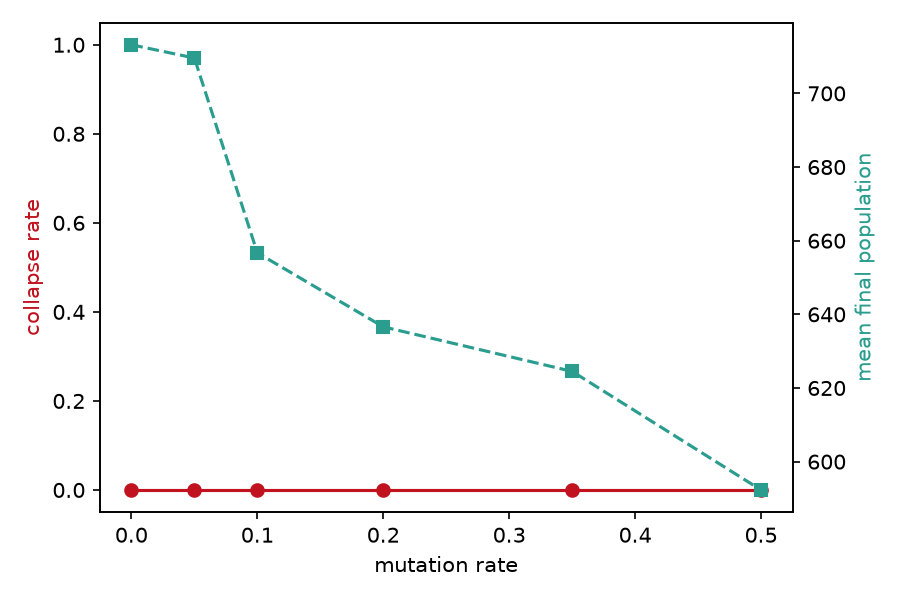
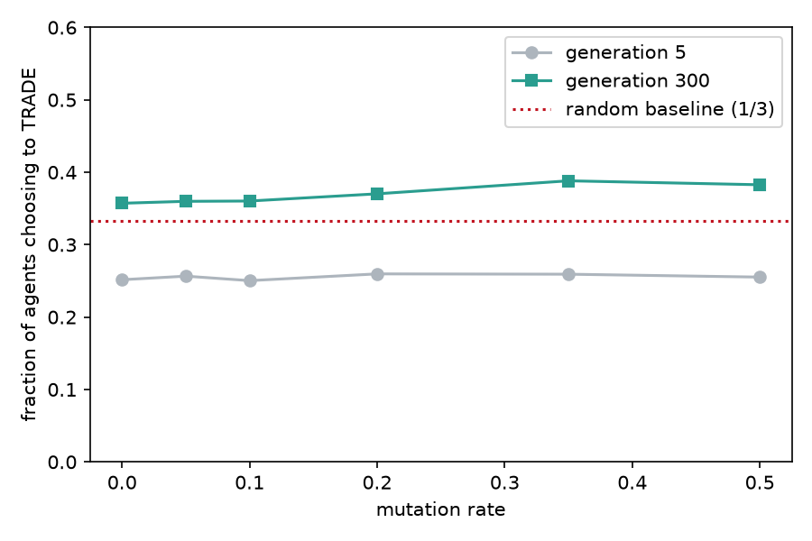
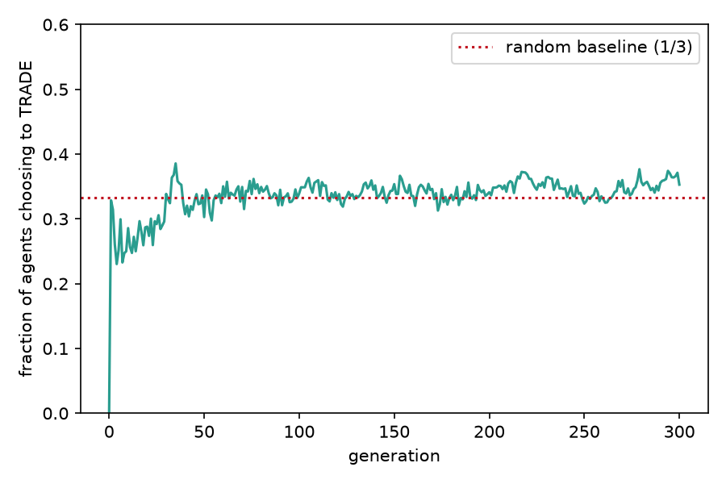
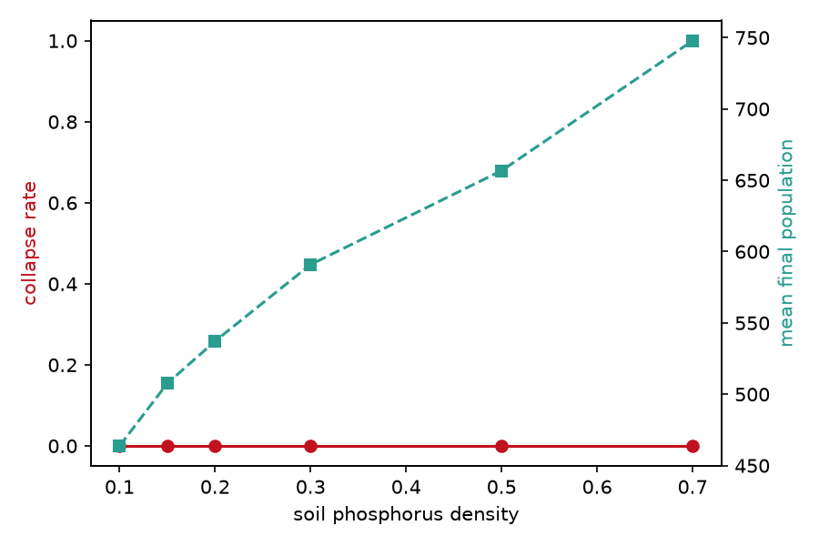
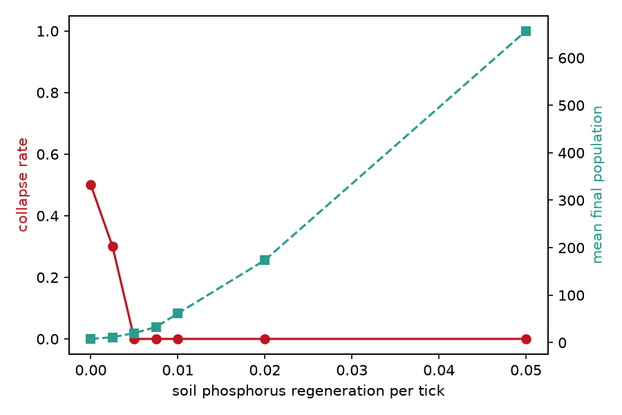
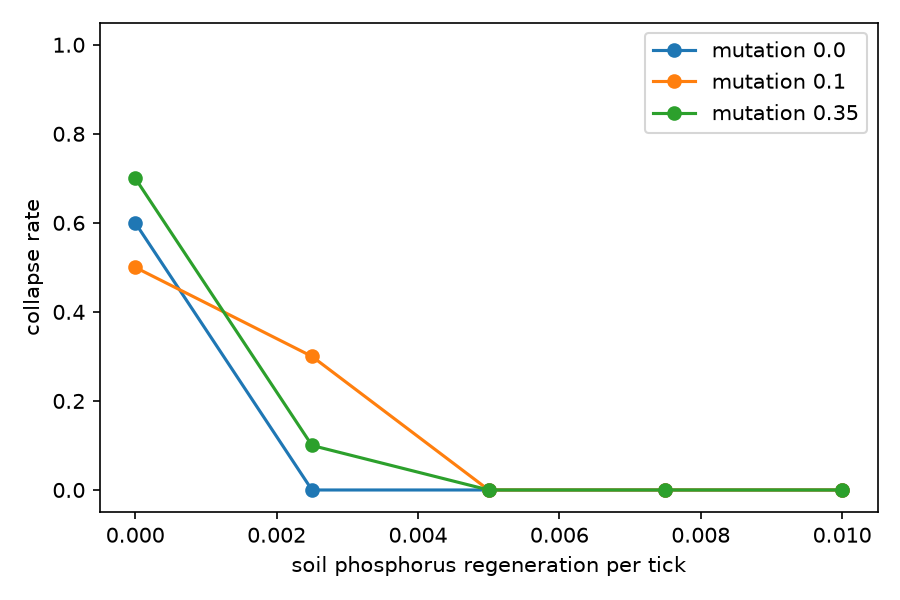
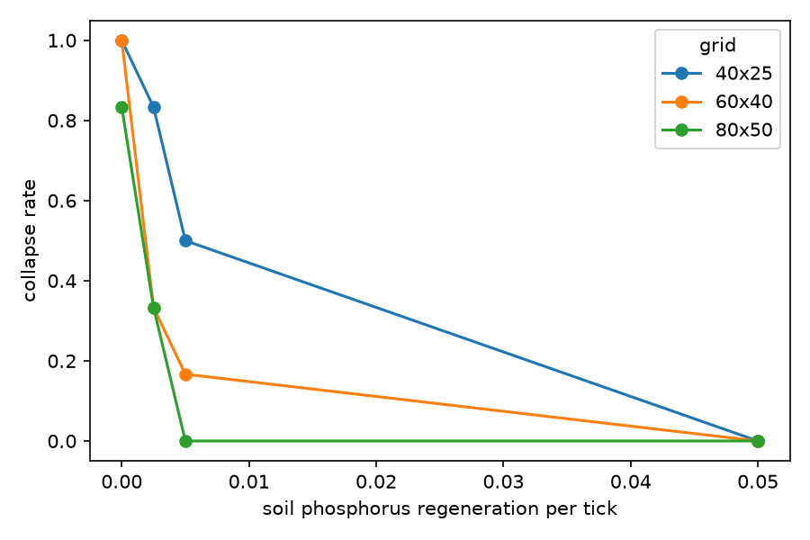
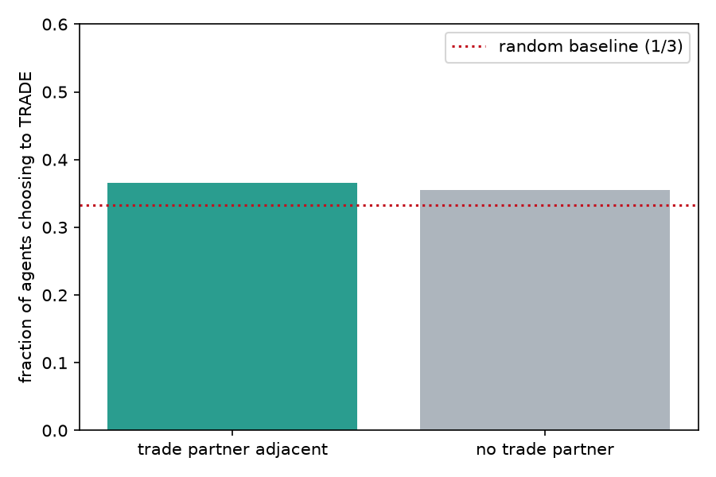

<!-- Target: Applications of Modelling and Simulation (AMS), free/Scopus/DOAJ. Convert to
     the AMS Word template before submission. Results/Discussion/Abstract are filled from
     paper/study/run_study.py output; do not edit numbers by hand; re-run the study. -->

## Abstract

We present Symbio-Grid, a spatial agent-based model in which plant and fungi agents trade
carbon and phosphorus under behavioral rules encoded in rule-tables that evolve by mutation
and selection, and we study when a stable trading mutualism emerges versus collapses. Across
ten seeds per condition we sweep the mutation rate, soil-phosphorus density, and phosphorus
regeneration rate, measuring collapse frequency, final population, and the fraction of agents
that choose to trade. Three results emerge. The mutualism is robust across mutation rates
(0.0 to 0.5) and phosphorus densities (0.1 to 0.7), collapsing only when renewable phosphorus
input approaches zero, a sharp resilience threshold near 0.005 units per tick. Cooperation is
selected rather than assumed: from random rule-tables, expressed trading rises above the
one-in-three chance level and, under scarcity, reaches nearly twice that level among
survivors. Finally, this selection signal is visible only when trading is measured over the
states agents actually visit, not by averaging over the whole rule-table, a caution for
evolvable-strategy models. The model and all experiments are open source and reproducible.

## 1. Introduction

Mutualism, cooperation between species that exchange resources, is widespread in nature, yet
how it arises and remains stable when either partner could instead defect is a long-standing
question in ecology and complex-systems science. Mycorrhizal symbiosis, in which plants
supply fungi with photosynthetic carbon in exchange for soil-derived phosphorus, is a
canonical example and has been described as a biological market in which each partner trades
the resource the other lacks [@simard2012mycorrhizal]. A central puzzle is that cooperation
is individually costly in the short term, so a purely self-interested agent might be expected
to hoard rather than trade; explaining the persistence of trade therefore requires a
mechanism, such as spatial structure, partner choice, or selection, that rewards cooperators.

Agent-based modeling (ABM) is well suited to studying such systems because macro-level order,
here a self-sustaining trading economy, can be observed as an emergent product of many simple
local interactions rather than being written into the model directly [@terhoeven2025mesa].
When the decision rules of the agents are themselves heritable and mutable, the model becomes
evolutionary: the distribution of strategies in the population is shaped over generations by
which strategies survive and reproduce. This lets one ask not only whether cooperation is
stable, but whether it is actively selected for from an initially random population.

This paper introduces *Symbio-Grid*, a spatial ABM in which the trading behavior of each
agent is not fixed but encoded in a rule-table that maps the agent's local perception to an
action, and which is inherited with mutation when the agent reproduces. Cooperation is thus
never imposed; it must evolve. We use the model to ask three questions. First, how does the
mutation rate affect whether a stable trading economy emerges or collapses, and does it
change the level of cooperation that evolves? Second, how robust is the mutualism to
phosphorus availability and, in particular, to the rate at which soil phosphorus is renewed?
Third, is cooperation actually selected for, and if so, in which situations do the agents
express it?

The contributions of this paper are: (i) an open-source, reproducible spatial ABM of
evolvable plant–fungi resource trading, described using the ODD protocol; (ii) a systematic
sweep study identifying a sharp resilience threshold in phosphorus renewal and a mutation
load on population size; (iii) direct evidence that trading is selected for, most strongly
under scarcity; and (iv) a methodological observation that this selection signal is visible
only in expressed behavior, not in whole-genotype averages. The remainder of the paper
reviews related work (Section 2), describes the model (Section 3) and the experimental setup
(Section 4), reports results (Section 5), and discusses their interpretation and limitations
(Sections 6 and 7).

## 2. Related work

Resource exchange in mycorrhizal symbiosis has been studied with both mathematical and
individual-based models. Simard et al. review the mechanisms, ecology, and modeling of
mycorrhizal networks and frame plant–fungal exchange in market terms
[@simard2012mycorrhizal]. Building on that framing, van 't Padje et al. show, through
experiment and modeling, that fungi adjust the "value" at which they trade phosphorus when
resource availability undergoes abrupt crashes and booms, so the terms of trade respond to
scarcity [@vantpadje2021phosphorus]. More recently, Grasso et al. present a
plant–mycorrhizal resource-trade co-evolution model in which trading strategies co-evolve and
which reproduces mutualism stability, extinction, and transitory parasitism through fitness
feedback [@grasso2025tradecoevolution]. These models emphasize quantitative ecological
realism, typically for a small number of interacting partners, and they establish that trade
terms and stability depend on relative resource values and on selection.

A parallel literature in complex systems and artificial life studies the evolution of
cooperation abstractly, often through spatial games in which strategies spread by imitation
or reproduction and cooperation is sustained by spatial clustering of cooperators. Evolvable
decision rules, encoded as lookup tables or bit-strings and modified by mutation and
crossover, are a common device for letting behavior adapt without hand-coding it. Symbio-Grid
sits between these traditions: it borrows the resource-trading, scarcity-sensitive economy of
the mycorrhizal models and the evolvable-rule, spatially explicit apparatus of the
artificial-life models.

On the software side, general ABM frameworks such as Mesa provide the scaffolding for
building and analyzing such models and ship ecological and evolving-strategy examples
[@terhoeven2025mesa; @masad2015mesa], and community standards such as the ODD protocol
support their transparent description and replication [@grimm2020odd]. What these frameworks
do not provide is a specific, ready-to-study, fully reproducible model of *evolvable* trading
mutualism with an interpretable strategy representation. Symbio-Grid contributes exactly
that: a spatially explicit model in which the unit of evolution is a legible rule-table,
released with both an interactive mode for exploration and a headless mode whose every result
is reproducible from a fixed seed.

## 3. Model description

The model is implemented on the Mesa framework and described here following the ODD
(Overview, Design concepts, Details) convention [@grimm2020odd].

### 3.1 Purpose
To study when an evolvable, spatially explicit plant–fungi resource-trading mutualism
reaches a stable equilibrium versus collapses, under varying mutation and resource stress.

### 3.2 Entities, state variables, and scales
Two agent types live on a toroidal `MultiGrid` of width W and height H. A **plant** is
stationary and holds carbon and phosphorus (each a real number in [0, 20]). A **fungus** is
mycelial and also holds carbon and phosphorus. The environment holds a soil-phosphorus field,
one scalar per cell in [0, 10]. One time step is one generation.

Each agent owns a **rule-table**: a length-64 array over the three actions available to its
species (a plant may TRADE, SPROUT, or IDLE; a fungus may TRADE, EXPAND, or IDLE). At each
step the agent forms an integer index in the range 0–63 from a discretized perception of its
local state and reads the corresponding action. The index packs three two-bit fields: the
agent's own carbon level, its own phosphorus level (each binned into four levels by dividing
by five and capping at three), and the number of relevant neighbors (adjacent partners of the
other species, capped at three). Writing these fields as $c$, $p$, and $n$, the index is
$(c \ll 4) \mathbin{|} (p \ll 2) \mathbin{|} n$. Because the perception uses only these
coarse features, the effective number of *distinct* states an agent actually encounters is
small, a fact that matters for the analysis in Section 5.

### 3.3 Process overview and scheduling
Each step, all agents act in random order through a sense–deliberate–act loop: they perceive
their neighborhood, index their rule-table to select an action, and execute it. Dead agents
are then removed, soil phosphorus is replenished, and the generation counter advances. All
randomness is drawn from a single seeded generator, making each run byte-identical under its
seed.

As a concrete illustration, consider a plant holding carbon 11 and phosphorus 3 with two
fungi in its Moore neighborhood. In the sense step it records its resources and its two
partners; in the deliberate step it bins carbon to level 2, phosphorus to level 0, and
partners to 2, forming the index $(2 \ll 4) \mathbin{|} (0 \ll 2) \mathbin{|} 2 = 34$ and
reads entry 34 of its rule-table, say TRADE. In the act step it first photosynthesizes and
pays its phosphorus cost, then, because a partner is present and the action is TRADE, it
gives carbon to one of the fungi and receives phosphorus in return. A sibling plant with the
same rule-table but no fungal neighbor would read a different entry and, even if that entry
were TRADE, could not act on it. Selection therefore operates only on the entries an agent's
circumstances actually cause it to read, which is the crux of the measurement issue discussed
in Section 6.

### 3.4 Design concepts
*Emergence:* a persistent trading economy (or its collapse) is not coded but arises from
local trades and selection. *Adaptation:* offspring inherit the parent rule-table with
per-locus mutation. *Objective:* implicit survival, since agents that fail to secure their
limiting resource die and leave no offspring. *Sensing:* an agent perceives its own
carbon/phosphorus, neighboring agents, and (for fungi) soil phosphorus in its Moore
neighborhood. *Interaction:* bilateral resource trade between adjacent plant and fungus.
*Stochasticity:* placement, rule-table initialization/mutation, and choices among equals.
*Observation:* per-tick populations and resources and end-state rule-tables are collected.

### 3.5 Initialization
N_p plants and N_f fungi are placed with fungi seated adjacent to plants so trade is
possible from the start. Soil phosphorus is drawn as Uniform(0, 10) scaled by a density
parameter. Plants start with carbon 5 and phosphorus 5; fungi with carbon 3 and phosphorus
5. All rule-tables are initialized uniformly at random.

### 3.6 Submodels
The submodels executed each step are as follows.

*Metabolism.* A plant photosynthesizes, gaining 1.0 carbon (capped at 20), and consumes
$d_p$ phosphorus (parameter `plant_p_decay`). A fungus consumes $d_c$ carbon (parameter
`fungi_c_decay`) and forages phosphorus: it draws up to $u$ units (parameter `fungi_uptake`)
from the cells of its Moore neighborhood including its own, taking greedily from the richest
cells first, which represents hyphae reaching into the surrounding soil. Carbon and
phosphorus are capped at 20.

*Trade.* If a plant's selected action is TRADE and at least one fungus is adjacent, it picks
one and the pair swap equal amounts of the resource each lacks: the plant gives carbon and
receives phosphorus, the fungus gives phosphorus and receives carbon. The traded amount is
$\min(0.25 \times \text{giver's stock}, 2.0)$ and executes only if the receiver holds enough
of the resource it must give in return, so a trade conserves total carbon and total
phosphorus across the two agents. Fungi trade symmetrically when their action is TRADE.

*Reproduction.* A plant whose action is SPROUT, or a fungus whose action is EXPAND,
reproduces if an empty neighboring cell exists and it holds sufficient resources (carbon
above 12 and phosphorus above 6 for plants; phosphorus above 6 and carbon above 4 for fungi).
The child is placed in the empty cell, inherits a copy of the parent's rule-table with each
entry independently re-randomized with probability equal to the mutation rate, and receives
40% of each of the parent's resources, which the parent loses.

*Mortality.* An agent dies and is removed when its limiting resource (phosphorus for plants,
carbon for fungi) reaches zero.

*Environment.* After all agents have acted and the dead have been removed, every soil cell
regenerates phosphorus by $r$ (parameter `phosphorus_regen`), capped at 10.

### 3.7 Parameters
Table 1 lists the default parameters, which are held fixed except where a parameter is the
subject of a sweep.

| Parameter | Symbol | Default | Meaning |
|---|---|---|---|
| Grid width × height | W × H | 60 × 40 | toroidal grid size |
| Initial plants / fungi | | 80 / 60 | starting populations |
| Rule-table size | | 64 | perceptual states per agent |
| Mutation rate | | 0.1 | per-entry re-randomization on reproduction |
| Phosphorus density | | 0.5 | scales initial soil phosphorus |
| Phosphorus regeneration | r | 0.05 | soil phosphorus added per cell per step |
| Fungi uptake | u | 1.2 | max phosphorus a fungus forages per step |
| Plant phosphorus decay | d_p | 0.15 | phosphorus a plant consumes per step |
| Fungi carbon decay | d_c | 0.1 | carbon a fungus consumes per step |

### 3.8 Implementation and reproducibility
The model is implemented in Python on the Mesa framework [@terhoeven2025mesa]. All
stochasticity (initial placement, rule-table initialization, mutation, and the choice among
tied options) is drawn from a single random generator seeded once per run, so a given seed
and configuration reproduce a run exactly, down to byte-identical metric output. A run is
driven either interactively, for observation, or headlessly through a batch runner that
records per-tick population and resource series, a snapshot of every surviving agent's
rule-table, and a manifest capturing the configuration, seed, and code version. This
determinism is what allows the same model to serve both exploration and controlled
experimentation without the two diverging, and it makes every figure in this paper
regenerable from the accompanying scripts.

## 4. Experimental setup

All experiments use the default grid and initial populations and are run for 300
generations with 10 random seeds each; a run is recorded as *collapsed* if either species
goes extinct. For each run we record the collapse outcome and the final total population.
To measure selection for cooperation we use an *expressed* metric: the fraction of living
agents that actually choose the TRADE action in the situation they are in, recorded per
tick. Because a randomly initialized rule-table selects any of the three actions with equal
probability, a value above 1/3 indicates that selection has enriched trading behavior. (We
deliberately avoid averaging TRADE over the whole 64-entry rule-table, because agents visit
only a few states, so the unexpressed majority of entries drift neutrally and mask the
signal; see the Discussion.)

- **Experiment A (mutation rate):** sweep the per-locus mutation rate over
  {0.0, 0.05, 0.1, 0.2, 0.35, 0.5}.
- **Experiment B (phosphorus availability):** sweep soil-phosphorus density over
  {0.1, 0.15, 0.2, 0.3, 0.5, 0.7}.
- **Experiment C (phosphorus renewal):** sweep the soil-phosphorus regeneration rate over
  {0.0, 0.0025, 0.005, 0.0075, 0.01, 0.02, 0.05} to locate the resilience boundary.
- **Experiment D (mutation × renewal interaction):** run the full factorial of mutation rate
  {0.0, 0.1, 0.35} and regeneration rate {0.0, 0.0025, 0.005, 0.0075, 0.01} to test whether
  mutation shifts the resilience threshold.
- **Experiment E (grid-scale robustness):** repeat the regeneration sweep {0.0, 0.005, 0.02,
  0.05} at grid sizes 40 × 25, 60 × 40, and 80 × 50 (8 seeds, 200 generations) to check that
  the resilience threshold is not an artifact of a single scale.
- **Experiment F (mechanism of selection):** for ten runs at the default configuration, at
  generation 300 we recompute each surviving agent's chosen action and split the population
  by whether a trade partner is currently adjacent, to test whether the selected behavior is
  *conditional* trading (trading when a partner is present).

Experiments A–C are reproducible via `paper/study/run_study.py` and D–F via
`paper/study/run_study_extended.py`; parameter values, seeds, and generation counts are
recorded there and in each run's manifest.

## 5. Results

All values are means over 10 seeds per parameter point; "±" denotes one standard
deviation of the final total population.

### 5.1 Mutation rate (Experiment A)
No run collapsed at any mutation rate from 0.0 to 0.5. The final population declined
modestly and monotonically with mutation, from 713 ± 128 individuals at rate 0.0 to
592 ± 72 at rate 0.5, a mutation load that thins the population without destabilizing it.
Expressed trading rose from about 0.25 early (generation 5) to 0.357–0.388 by generation
300, above the 1/3 random baseline at every mutation rate, indicating that selection
enriches trading behavior even at rate 0.0 (selection acting on the standing variation in
the initial random rule-tables). The late-generation trading fraction increased with
mutation rate, peaking at 0.388 at rate 0.35, so higher mutation yielded slightly more
expressed cooperation alongside fewer individuals (Figures 1–2).

### 5.2 Phosphorus availability (Experiment B)
No run collapsed across soil-phosphorus densities from 0.1 to 0.7. The final population
scaled with resource availability, roughly linearly, from 464 ± 83 at density 0.1 to
748 ± 96 at density 0.7, so phosphorus supply sets the carrying capacity. Expressed trading
remained modestly above baseline (about 0.34–0.38) with no strong dependence on density
(Figure 4).

### 5.3 Resilience threshold (Experiment C)
The mutualism collapsed only when renewable phosphorus input was near zero: 50% of runs
collapsed at regeneration rate 0.0 and 30% at 0.0025, but no run collapsed at 0.005 or
above. That marks a sharp resilience threshold near 0.005 units per cell per tick. Final population
rose steeply with renewal, from 8 ± 3 survivors at rate 0.0 to 657 ± 82 at rate 0.05.
Notably, expressed trading was highest under scarcity: survivors at the survivable edge
(rates 0.005–0.0075) traded at about 0.64, nearly double the baseline, declining toward
0.36 as phosphorus became abundant. Resource scarcity thus intensified selection for
cooperation among the survivors (Figure 5).

### 5.4 Cooperation over time
For a representative run, the fraction of agents choosing to trade began below the random
baseline and settled modestly above it within roughly fifty generations, then remained
there (Figure 3).

### 5.5 Mutation × renewal interaction (Experiment D)
The resilience threshold is essentially independent of the mutation rate. Under zero renewal,
roughly half to two-thirds of runs collapsed at every mutation rate (collapse rates 0.6, 0.5,
and 0.7 at rates 0.0, 0.1, and 0.35), with no consistent ordering by mutation. At the
knife-edge renewal rate 0.0025 the outcome was noisy and partial (0 to 0.3 collapse), and at
renewal rates of 0.005 and above no run collapsed at any mutation rate. Mutation therefore
does not move the collapse boundary, which is governed by phosphorus renewal rather than by
the rate of behavioral variation (Figure 6).

### 5.6 Grid-scale robustness (Experiment E)
Run to 400 generations, the resilience threshold appears at every grid scale. Under zero
renewal essentially all runs collapsed (collapse rate 1.0 at 40 × 25 and 60 × 40, and 0.83
at 80 × 50); at the highest renewal (0.05) none collapsed at any scale. The transition lies
in the 0.0025 to 0.005 range for all three grids, with larger grids somewhat more resilient
near the boundary: at renewal 0.005 the collapse rate fell from 0.50 at 40 × 25 to 0.17 at
60 × 40 to 0.00 at 80 × 50. The threshold is therefore a robust feature across scales rather
than an artifact of one grid size, though its exact position shifts slightly with area.
Comparing with Experiment C, which used a 300-generation horizon, also shows that collapse
under zero renewal is progressive: more runs have collapsed by generation 400 than by
generation 300, because the finite soil stock drains gradually (Figure 7).

### 5.7 Mechanism of selected cooperation (Experiment F)
We asked whether the selected trading is *conditional* on a partner being present. Among
surviving agents at generation 300, the fraction choosing to trade was 0.365 when a trade
partner was adjacent (n = 6232) and 0.355 when none was adjacent (n = 335): both only
slightly above the 1/3 chance level, and nearly equal. Contrary to our expectation, the
selected increase in trading is therefore mild and largely *unconditional* under benign
default conditions. Evolution nudges the population toward trading somewhat more than
chance, but does not produce a sharply partner-conditional strategy here. Read together with
the scarcity result of Experiment C, where expressed trading reached about 0.64, this
suggests that a steeper, more strongly selected trading response emerges only when resources
are tight (Figure 8).

## 6. Discussion

Three observations stand out. First, the trading mutualism is robust: it persists across a
wide range of mutation rates and phosphorus availabilities, and collapses only when
renewable phosphorus input falls essentially to zero. This is intuitive in hindsight.
Without renewal, the only phosphorus in the system is the finite initial soil stock, which
the agents mine and consume until it is exhausted. Yet the transition is sharp, with even
0.005 units per tick sufficing to sustain the ecosystem indefinitely. The threshold is
governed specifically by renewal: it does not move with the mutation rate (Experiment D), and
it recurs at a similar location across the grid scales we tested (Experiment E), with larger
grids only slightly more resilient near the boundary. In other words, whether the economy
survives is set mainly by the environment's capacity to replenish the limiting resource, not
by how fast behavior varies or, to first order, by the size of the world.

Second, cooperation is selected for rather than assumed. Starting from random rule-tables,
the fraction of agents that actually choose to trade rises above the level expected by
chance and stays there. The effect is modest under benign conditions but pronounced under
scarcity: at the edge of viability the survivors are strongly cooperative, trading at
roughly twice the chance rate. The mechanism analysis (Experiment F) qualifies this picture:
under benign default conditions the enrichment of trading is only slight and is not strongly
conditional on a partner being present, so the population evolves a mild, largely
unconditional propensity to trade rather than a finely tuned partner-contingent rule. The
sharp, near-doubling response appears specifically under scarcity. This pattern is consistent
with the biological-market view that a partner's resource becomes more valuable as it becomes
scarcer [@vantpadje2021phosphorus] and echoes, in a spatial evolutionary setting, the
stability-through-fitness-feedback result of recent trade co-evolution models
[@grasso2025tradecoevolution].

Third, there is a methodological caution. Averaging the TRADE action over the whole 64-entry
rule-table gives a value indistinguishable from the 1/3 random baseline, which would wrongly
suggest that no selection occurs. The signal appears only when trading is measured
over the states agents actually visit, because the many never-expressed rule-table entries
drift neutrally and dilute the average. Analysts of evolvable-strategy ABMs should measure
expressed behavior, not genotype averages.

The sharp collapse at zero renewal is naturally read as a critical transition. The system has
two qualitatively different long-run regimes, a populous self-sustaining trading economy and
a drained, empty grid, and a narrow band of renewal rates separates them. The transition is
also path-dependent and effectively irreversible within a run: once the finite soil stock is
mined below the level the population needs, there is no trading strategy that can recover it,
because the resource itself is gone rather than merely misallocated. This distinguishes the
collapse from a behavioral failure; it is a resource-exhaustion tipping point. The
progressive nature of the collapse under zero renewal, visible in the difference between the
300- and 400-generation horizons, is the slow approach to that tipping point as the stock
runs down. Such threshold behavior, where a slowly changing environmental driver produces an
abrupt regime shift, is a recurring theme in the study of resilience in ecological and other
complex systems, and Symbio-Grid reproduces it from purely local rules.

The model's intended use also shapes how these results are best read. Symbio-Grid is built to
run both as an interactive visualization and as a headless, reproducible experiment engine,
and the experiments reported here were designed to be repeatable by a student or reader in a
single session. The three findings map onto three teachable ideas: emergence (a global
trading economy arising without central control), evolution by natural selection (a heritable,
mutable behavior enriched by differential survival), and critical transitions (a sharp,
driver-controlled collapse). Because each result is reproducible from a fixed seed and every
parameter is exposed, the same figures can be regenerated and the same questions re-posed with
different parameters, which makes the model as useful as a hands-on teaching instrument as it
is as a research testbed. We regard this dual character, rather than any single quantitative
result, as the model's main contribution.

These findings are exploratory, and several limitations should temper their interpretation.
The model is not calibrated to or validated against empirical data, so the results are
qualitative properties of the model rather than quantitative predictions about real
mycorrhizal systems. Although we varied the grid scale, we held the initial population
composition, the resource caps, and the trade and reproduction thresholds fixed, and each
parameter point rests on a modest number of seeds (six to ten), so the noisy behavior at the
collapse knife-edge is estimated only coarsely. Most importantly, the cooperation signal,
while consistent and statistically visible, is small under benign conditions and becomes
large only under scarcity; we would not want to overstate it. The perception available to
each agent is deliberately coarse (three binned features), which both enables the
interpretable rule-table and limits the strategies that can evolve.

Several extensions follow naturally. Calibrating the metabolic and trade parameters against
measured carbon–phosphorus exchange would turn the qualitative threshold into a quantitative
one. Giving agents richer perception or an explicit partner-choice mechanism would let more
sophisticated, conditional strategies evolve and would test whether the weak
partner-conditionality seen here is a limitation of the perception rather than of selection.
A fuller sensitivity analysis over the remaining parameters, longer horizons, and a
finer-grained analysis of exactly which perceptual states carry the selected behavior would
each sharpen the picture. Finally, because the model runs both interactively and headlessly
and is fully reproducible, it is well suited to classroom and outreach use, where the same
experiments reported here can be reproduced and extended by students.

## 7. Conclusion

Symbio-Grid demonstrates that a stable resource-trading mutualism can emerge and be selected
for from random strategies, and it quantifies how mutation, phosphorus availability, and
phosphorus renewal shift the balance between a persistent economy and collapse. The clearest
result is a sharp resilience threshold at near-zero phosphorus renewal that is set by the
environment rather than by the population: it does not move with the mutation rate and recurs
across grid scales. Cooperation is genuinely selected from random strategies, but the effect
is mild and largely unconditional under benign conditions and becomes strong only under
scarcity. Our mechanism analysis makes that pattern explicit, and it only appears when
trading is measured in expressed behavior rather than in whole-genotype averages. Beyond the
specific findings, the model is offered as an open, reproducible, and interactively
explorable testbed for the emergence and evolution of cooperation, in which every result
here can be regenerated from a fixed seed and extended. The software and all experiment
scripts are openly available.

## References
